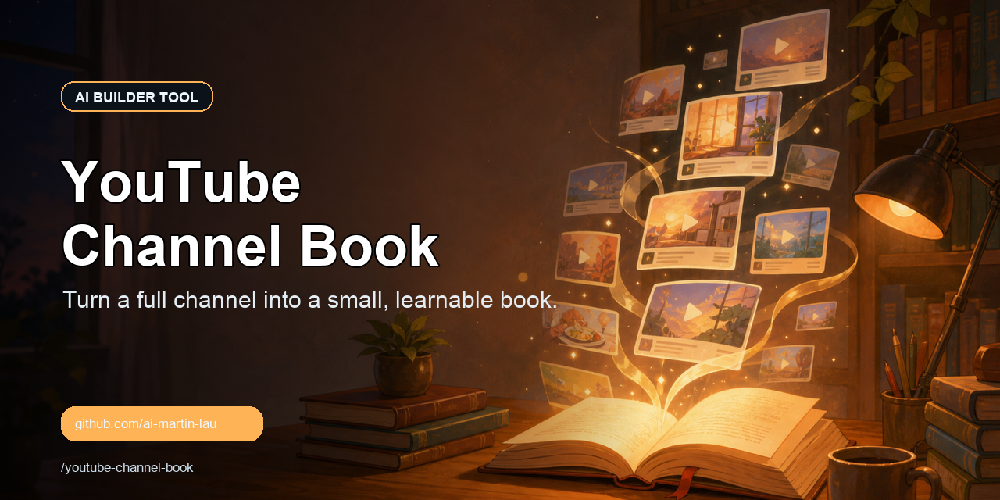

<p align="center">
  <a href="README.md">English</a> · <a href="README_ZH.md">简体中文</a> · <a href="README_JA.md">日本語</a> · <a href="README_KO.md">한국어</a> · <a href="README_ES.md">Español</a>
</p>

<p align="center">
  
</p>

# youtube-channel-book

> Turn an entire YouTube channel into a small, learnable book — crawl every video's
> captions, then distill the channel's essence into structured chapters.

This is a [Claude Code](https://claude.com/claude-code) **Skill**. Drop it into `.claude/skills/`
(project-level) or `~/.claude/skills/` (global), then tell Claude:

> "Summarize the channel https://www.youtube.com/@DanKoeTalks into a small book"

Claude takes care of the rest: list videos → fetch captions → convert to text → distill in parallel → synthesize into `BOOK.md`.

## What it solves

By 2026, grabbing YouTube captions in bulk has become genuinely hard (PO Tokens, virtualized lists, restricted networks). This skill bakes in the key moves that actually work:

- **Captions without a PO Token**: uses `yt-dlp --extractor-args "youtube:player_client=android_vr"`
  —— currently the only client that reliably works without a PO Token. `web/mweb/tv` can't get captions at all.
- **Full channel listing**: YouTube's new grid is virtualized and the DOM keeps only ~30 cards; the script scrolls and accumulates as it goes, capturing everything.
- **Won't blow up the context**: captions for N videos can run to millions of tokens —— parallel sub-Agents distill in batches, and the main thread only collects the essence.
- **Reads like a book**: organized into chapters by theme, preserving the author's signature frameworks, numbers, and memorable lines rather than generic platitudes.

## Pipeline

```
@handle ──①list_videos.mjs──> videos.tsv
        ──②fetch_subs.sh────> subs/*.json3   (android_vr, no PO Token)
        ──③json3_to_text.py─> txt/*.txt
        ──④parallel sub-Agents──> per-batch essence
        ──⑤synthesize───────> BOOK.md  📖
```

## Dependencies

- [Claude Code](https://claude.com/claude-code)
- The [`web-access`](https://github.com/eze-is/web-access) skill (its CDP Proxy is used to scrape the channel listing)
- Python ≥ 3.10, `yt-dlp` (the script downloads the zipapp automatically)

## Files

| Path | Purpose |
|---|---|
| `SKILL.md` | Orchestration instructions (this is what Claude reads) |
| `scripts/list_videos.mjs` | CDP scrape of every video id + title in the channel |
| `scripts/fetch_subs.sh` | yt-dlp bulk caption download (android_vr) |
| `scripts/json3_to_text.py` | json3 captions → plain text |
| `references/extractor-prompt.md` | Sub-Agent distillation template |
| `references/book-template.md` | Book structure template |
| `references/troubleshooting.md` | Anti-scraping pitfalls and troubleshooting |

## Running it manually (works without Claude too)

```bash
WORK=./out; SKILL=.
node "$SKILL/scripts/list_videos.mjs" "@DanKoeTalks" "$WORK/videos.tsv"   # requires the web-access Proxy to be running
cut -f1 "$WORK/videos.tsv" > "$WORK/ids.txt"
bash "$SKILL/scripts/fetch_subs.sh" "$WORK/ids.txt" "$WORK/subs"
python3 "$SKILL/scripts/json3_to_text.py" "$WORK/subs" "$WORK/txt"
# then hand txt/ to an LLM to distill in batches and synthesize into a book
```

## License

MIT

## Star History

[](https://star-history.com/#ai-martin-lau/youtube-channel-book&Date)
